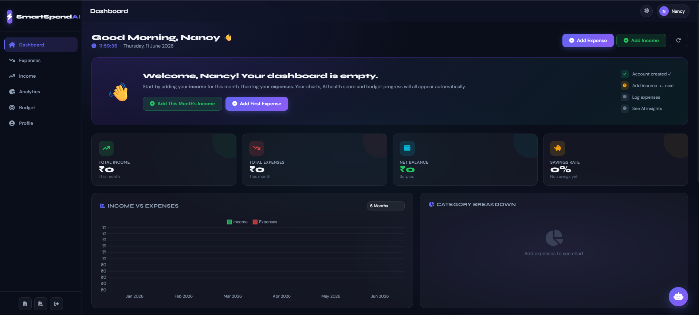

# 💰 SmartSpend AI

SmartSpend AI is a modern personal finance management platform built with Python and Flask that helps users track income, manage expenses, monitor budgets, and gain valuable financial insights through an interactive dashboard.

Designed for students and young professionals, SmartSpend AI provides a clean user experience with powerful analytics to support smarter financial decisions.

---

## 🚀 Features

* 🔐 Secure User Authentication
* 💵 Income Tracking
* 🧾 Expense Management
* 📊 Interactive Dashboard
* 📈 Financial Analytics
* 🎯 Budget Monitoring
* 🤖 AI-Powered Financial Insights
* 📱 Responsive User Interface
* 🌙 Modern Dark-Themed Design

---

## 🛠️ Technology Stack

* Python
* Flask
* HTML5
* CSS3
* JavaScript
* SQLite
* Bootstrap
* Chart.js

---

## 📸 Project Screenshots

### 🏠 Home Page


Modern landing page introducing SmartSpend AI and its key features.

---

### 🔑 Login Page


Secure login interface with a clean and professional design.

---

### 🚀 Signup Page


User registration page for creating a new SmartSpend AI account.

---

### 📊 Dashboard



Interactive dashboard displaying income, expenses, balance, savings rate, and financial analytics.

---

## 📂 Project Structure

```text
SmartSpend/
│
├── screenshots/
│   ├── Home Page.png
│   ├── Login Page.png
│   ├── Signup Page.png
│   └── Dashboard.png
│
├── static/
├── templates/
├── app.py
├── requirements.txt
├── database.db
└── README.md
```

## ⚙️ Installation

### Clone Repository

```bash
git clone https://github.com/Nancydua11/smartspend-ai.git
```

### Navigate to Project

```bash
cd smartspend-ai
```

### Install Dependencies

```bash
pip install -r requirements.txt
```

### Run Application

```bash
python app.py
```

### Open Browser

```text
http://127.0.0.1:5000
```

---

## 🎯 Key Functionalities

* Add Income Sources
* Record Daily Expenses
* Track Monthly Spending
* Visualize Financial Trends
* Monitor Savings Rate
* Analyze Expense Categories
* Manage Personal Budget

---

## 🔮 Future Enhancements

* AI Expense Prediction
* Smart Saving Recommendations
* PDF & Excel Report Export
* Bank Account Integration
* Mobile Application
* Advanced Analytics Dashboard

---

## 👩‍💻 Author

### Nancy Dua

Computer Science Engineer
Data Analytics Enthusiast
Power BI Developer

LinkedIn: [www.linkedin.com/in/nancy-dua-a90a48298](http://www.linkedin.com/in/nancy-dua-a90a48298)

---

## ⭐ Support

If you found this project useful, please consider giving it a ⭐ on GitHub.
